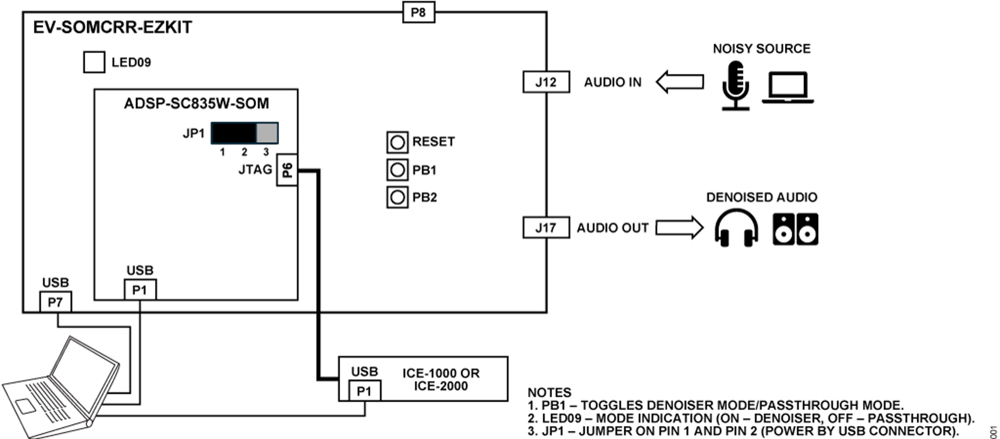
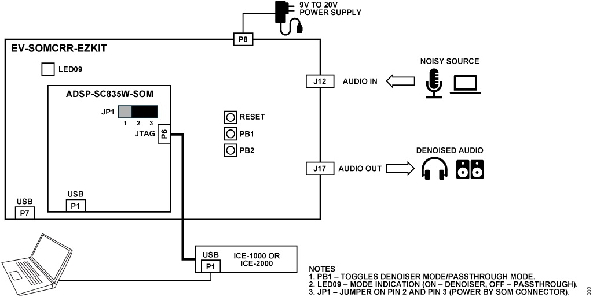
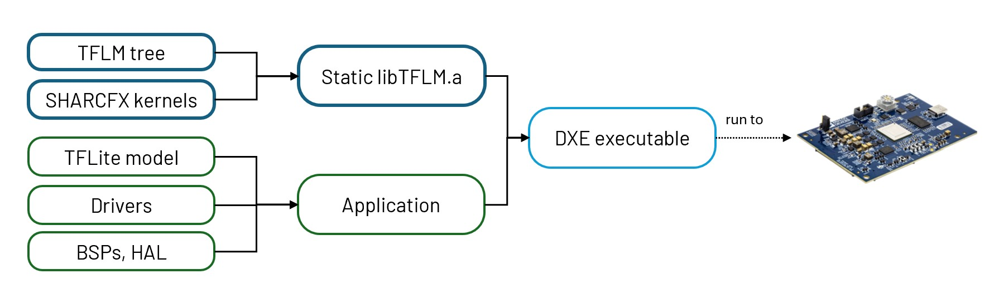

<!--
SPDX-FileCopyrightText: 2025 Analog Devices Inc.
SPDX-License-Identifier: Apache-2.0
-->

# Tensorflow Lite for Microcontrollers

This repository contains for the TensorFlow Lite for Microcontrollers port supporting ADI microcontrollers and digital signal processors. 

# License

This project is covered under the [Apache License 2.0](LICENSE).

# Overview

The TFLite Micro Library for SHARC-FX is built upon the TensorFlow Lite Micro framework developed by Google. You can read more about this framework [here](https://www.tensorflow.org/lite/microcontrollers). The product consists of the TFLite Micro library for SHARC-FX, sample applications and associated documents. This repository contains code from TFLM master branch as of [July 2023](https://github.com/tensorflow/tflite-micro/tree/main). This port was created following the [new platform support instructions](https://github.com/tensorflow/tflite-micro/blob/main/tensorflow/lite/micro/docs/new_platform_support.md). 

Our optimized implementation of this framework is designed to specifically run on ADI’s SHARC-FX line of processors. Currently, this contains support for the following devices.
-	[ADSP-SC835 Datasheet and Product Info | Analog Devices](https://www.analog.com/en/products/adsp-sc835.html)

This codebase was tested with CrossCore Embedded Studio >3.0.0 on a Windows 10 host machine. For information about the CrossCore Embedded Studio tool chain refer to [www.analog.com/cces](www.analog.com/cces). For more information on the latest ADI processors, technical support and any other additional information, please visit our website at [http://www.analog.com/processors](http://www.analog.com/processors).

# Prerequisites and System Setup

## Required Hardware
You will need the following hardware:

1. [Analog Devices ADSP-SC835W-SOM](https://www.analog.com/en/resources/evaluation-hardware-and-software/evaluation-boards-kits/adspsc835w-ev-som.html) - This is a small board containing the SC835 processor (SHARC-FX + M33) and JTAG.
2. [Analog Devices EV-SOMCRR-EZKIT](https://www.analog.com/en/resources/evaluation-hardware-and-software/evaluation-boards-kits/ev-somcrr-ezkit.html) - This adapter board provides all of the peripherals for the denoiser application.
3. [ICE-1000 or ICE-2000](https://www.analog.com/en/resources/evaluation-hardware-and-software/evaluation-boards-kits/emulators.html) - An in-circuit emulator used to debug and download the application to the processor.
4. USB cable with USB A and Micro USB-B connectors (for ICE connection)
5. USB cable with Type A connectors (for carrier board connection)
6. USB cable with Type C connectors (for SOM board connection)
7. 12 V AC adaptor to Power EV-SOMCRR-EZKIT board

## Hardware Setup and Connection Diagram

You have the option to power the board via USB or from an AC-DC power supply. The diagrams below show the connections for these two power options. Please take that the JP1 jumper setting changes depending on the power source used. 


</br>
Figure 1. System block diagram using USB power supply 
</br></br>


</br>
Figure 2. System block diagram using 9V-20V DC power supply 
</br>

## Software Prerequisites

To build the project, you will need to download and install the following software:

- CrossCore Embedded Studio
  - You will need CrossCore Embedded Studio, version 3.0.0 and above, available from [analog.com/cces](https://www.analog.com/cces). CrossCore Embedded Studio includes a 90-day full-featured trial license. Alternatively, the SC835W SOM provides a license that is not time-limited but restricted to use with the ADSP-SC835 and ICE-1000.

- Make (> 4.3.0)
  - You will need this if you want to run the headless build workflow.

# Building the example application

### About the example applications
The [examples](examples) folder includes the SHARC-FX port for the DTLN(Dual-signal Transformation LSTM Network) denoiser application. This example utilizes the ADAU1979 ADC and the ADAU1962A DAC to operate in I2S mode for audio talkthrough that has been leveraged to run the DTLN denoiser in realtime. 

Building the example application is a two-stage process. First, you will need to build the static library archive (`libTFLM.a`). The generated library archive is then linked and built together with the example application project to create the executable file. To illustrate: 


</br></br>

We will discuss two options to build and run the examples:
  * [via CCES IDE](#option-1-via-the-cces-ide)
  * [via Headless Build](#option-2-via-the-headless-build)

### Option 1: via the CCES IDE

Follow the steps below for a graphical-based approach

First, open the project on CCES:

1. Open the project by choosing the *File > Import* in CrossCore Embedded Studio. 
2. In the *Import* window, select *Existing Projects* into Workspace and click *Next*. 
3. In the next window, click *Browse* and provide the path to the [examples](examples) directory as the *Select root* directory. 
4. Select any of the projects and click *Finish*. 
5. You will see the opened project in the IDE’s Project Explorer.

Next, build the `libTFLM.a` file:
1. Right click on the opened project and click on *Build Configurations > Set Active*. You may choose either the *Debug* or *Release* for the build configuration.
2. For the selected configuration:
  - Click *Project > Clean*. Ensure that only the required project is selected in the *Clean* window. If desired, build the project immediately after cleaning. Configure to start a build immediately only for the selected project and click *OK*. This is an optional, but recommended step.
  - If the previous step has not already built the project, then click *Project-> Build Project* or press F7.
  - The binary (*.dxe) will be created in the `Debug` or `Release` folder located in the workspace, depending on the selected configuration. The workspace folder is specified at the top of this section.

At this point, you should have a `libTFLM.a` library archive located inside the `Debug` or `Release` folder.

Instructions to build and run the examples are found in their respective READMEs.
- [Denoiser Real-time](examples/denoiser_realtime/README.md)
- [Denoiser File I/O](examples/denoiser_fileio/README.md)

We have also included utilities for automated model conversion for the DTLN model. These are available in the [utils](Utils) directory. 
- [Automated model conversion for DTLN](Utils/automated-model-conversion-dtln/README.md)


### Option 2: via the Headless build 

We also provide a CLI-based build workflow that is equivalent to the IDE-based workflow in the CCES ecosystem. At the monent, the headless interface only supports the building `libTFLM.a` library archive. Support to build the examples and generate the *.dxe executables will be included in future releases. 

To build the library archive for TFLM with the optimized kernels, run make on the top-level directory:
```
make
```

By default, the build script uses `/c/analog/cces` as the CCES search path for the SHARC-FX toolchains and the default target is for the [ADSP-SC835](https://www.analog.com/en/products/adsp-sc835.html). </br> `RELEASE` is the default configuration but you may also select to `DEBUG` configuration mode.

To configure these, run
```
make CCES=</path/to/cces> TARGET=<DEVICE_NAME> CONFIG=<CONFIG_MODE>
```
The script will output a `./build/libTFLM.a` library which can be linked to other projects using the `-lTFLM` flag. 

Build objects are stored in the `./build` directory. To remove these, run
```
make clean
```

# Getting Help

Please raise a GitHub Issue for support. 